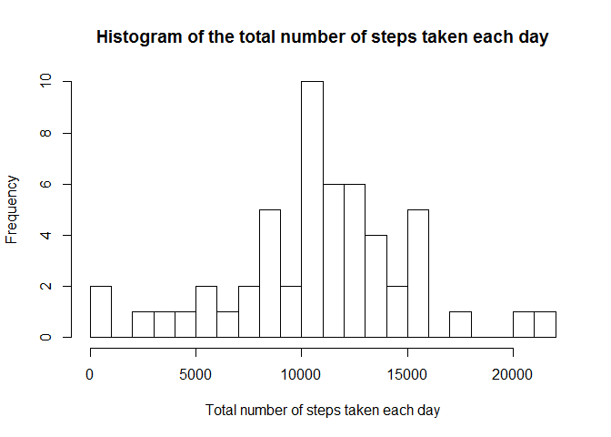
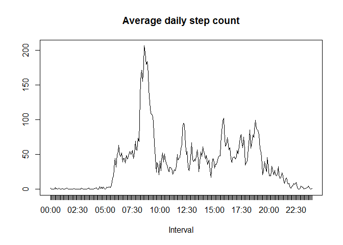
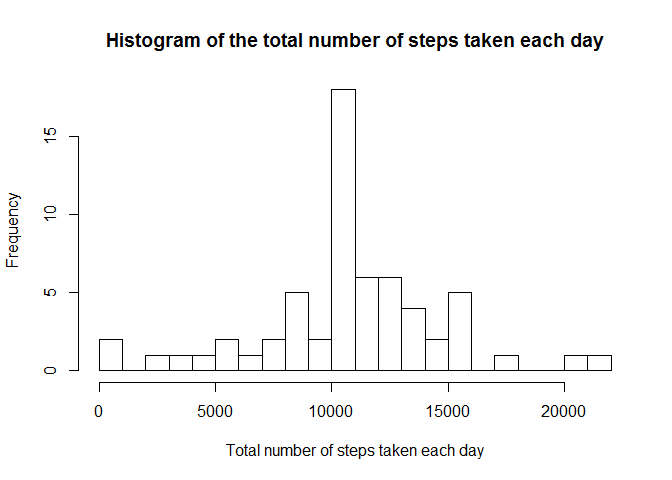
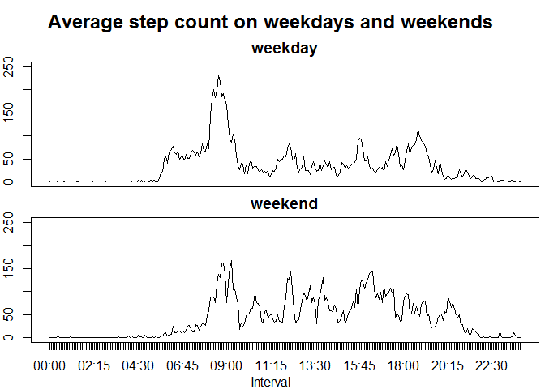

# Reproducible Research: Peer Assessment 1
## Introduction

It is now possible to collect a large amount of data about personal movement using activity monitoring devices such as a Fitbit, Nike Fuelband, or Jawbone Up. These type of devices are part of the “quantified self” movement – a group of enthusiasts who take measurements about themselves regularly to improve their health, to find patterns in their behavior, or because they are tech geeks. But these data remain under-utilized both because the raw data are hard to obtain and there is a lack of statistical methods and software for processing and interpreting the data.

This report makes use of data from a personal activity monitoring device. This device collects data at 5 minute intervals through out the day. The data consists of two months of data from an anonymous individual collected during the months of October and November, 2012 and include the number of steps taken in 5 minute intervals each day.

## Loading and preprocessing the data

First we unzip the original data overwriting any existing instace to avoid potential modifications of the csv file. Valid activity.zip file shall be in the working directory.

```r
unzip("activity.zip")
activity<- read.csv("activity.csv")
```

We transform interval values to a more readable hh:mm format. We transform dates to date format.

```r
activity$interval <- sprintf("%04d", activity$interval)
activity$interval <- paste(substr(activity$interval, 1, 2), ":", substr(activity$interval, 3, 4), sep="")
activity$interval <- as.factor(activity$interval)
activity$date <- as.Date(activity$date)
```

## What is mean total number of steps taken per day?

We make a histogram of the total number of steps taken each day. Days with missing values are omitted.

```r
hist(with(activity, tapply(steps, date, sum), na.rm = TRUE),
        main = "Histogram of the total number of steps taken each day",
        xlab = "Total number of steps taken each day",
        breaks = 21,
        )
```

 

We calculate the mean and median total number of steps taken per day. Days with missing values are omitted not to distort the mean and median.

```r
mean(with(activity, tapply(steps, date, sum)), na.rm=TRUE)
```

```
## [1] 10766
```

```r
median(with(activity, tapply(steps, date, sum)), na.rm=TRUE)
```

```
## [1] 10765
```

## What is the average daily activity pattern?

We make a time series plot of the 5-minute interval (x-axis) and the average number of steps taken, averaged across all days (y-axis). Missing values are omitted when calculating the average in each interval.

```r
plot(with(activity, tapply(steps, interval, mean, na.rm = TRUE)),
     type = "l",
     xlab = "Interval",
     ylab = '',
     xaxt = "n",
     main = "Average daily step count"
     )
axis(1, at = 1:length(levels(activity$interval)), labels = levels(activity$interval))
```

 

We report which 5-minute interval, on average across all the days in the dataset, contains the maximum number of steps.

```r
library("plyr")
interval_mean <- ddply(activity, .(interval), summarise, mean_steps = mean(steps, na.rm = TRUE))
interval_mean[which.max(interval_mean$mean_steps),]
```

```
##     interval mean_steps
## 104    08:35      206.2
```

## Imputing missing values

We calculate and report the total number of missing values in the dataset (i.e. the total number of rows with NAs).

```r
sum(is.na(activity$steps))
```

```
## [1] 2304
```

We devise a strategy for filling in all of the missing values in the dataset. We use the mean for the particular 5-minute intervals and create a new dataset that is equal to the original dataset but with the missing data filled in.

```r
activity_m <- activity
activity_m[is.na(activity_m$steps), "steps"] <- interval_mean$mean_steps[match(activity_m[is.na(activity_m$steps), "interval"], interval_mean$interval)]
```

We make a histogram of the total number of steps taken each day and calculate and report the mean and median total number of steps taken per day.

```r
hist(with(activity_m, tapply(steps, date, sum)),
        main = "Histogram of the total number of steps taken each day",
        xlab = "Total number of steps taken each day",
        breaks = 21,
        )
```

 

```r
mean(with(activity_m, tapply(steps, date, sum)), na.rm=TRUE)
```

```
## [1] 10766
```

```r
median(with(activity_m, tapply(steps, date, sum)), na.rm=TRUE)
```

```
## [1] 10766
```

These values slightly differ from the estimates from the first part of the report. The impact of imputing missing data on the estimates of the total daily number of steps is insignificant in this case.

## Are there differences in activity patterns between weekdays and weekends?

We create a new factor variable in the dataset with two levels – “weekday” and “weekend” indicating whether a given date is a weekday or weekend day.

```r
Sys.setlocale("LC_TIME", "English")
activity_m$wdays <- as.factor(ifelse(weekdays(activity_m$date) %in% c("Saturday","Sunday"), "weekend", "weekday"))
Sys.setlocale("LC_TIME", "")
```

We make a panel plot containing a time series plot of the 5-minute interval (x-axis) and the average number of steps taken, averaged across all weekday days or weekend days (y-axis).

```r
par(mfrow = c(2, 1), mar = c(0, 2, 2, 0.2), oma = c(3, 0, 2, 0.2))
plot(with(activity_m[activity_m$wdays == "weekday",], tapply(steps, interval, mean, na.rm = TRUE)),
     type = "l",
     xlab = '',
     ylab = '',
     ylim = c(0, 250),
     xaxt = "n",
     main = "weekday"
     )
plot(with(activity_m[activity_m$wdays == "weekend",], tapply(steps, interval, mean, na.rm = TRUE)),
     type = "l",
     xlab = "Interval",
     ylab = '',
     ylim = c(0, 250),
     xaxt = "n",
     main = "weekend"
     )
axis(1, at = 1:length(levels(activity_m$interval)), labels = levels(activity_m$interval))
mtext("Average step count on weekdays and weekends", outer = TRUE, side = 3, font = 2, cex = 1.5)
mtext("Interval", outer = TRUE, side = 1, line = 2)
```

 

Weekend days show higher activity level through the entire day compared to weekdays, however the morning peek is higher on weekdays.
